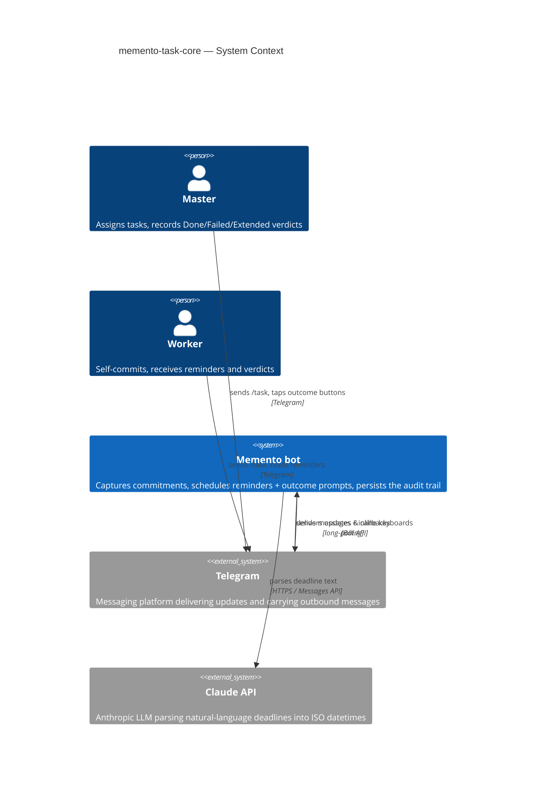
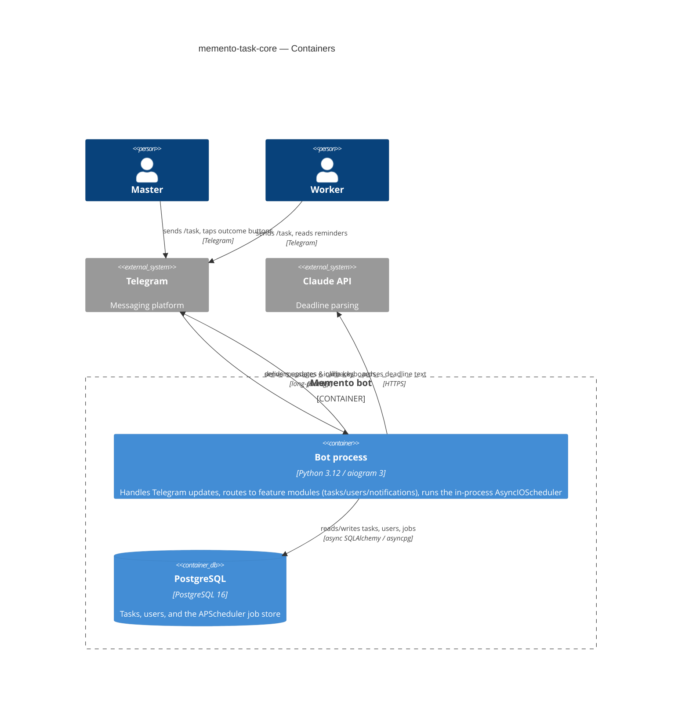
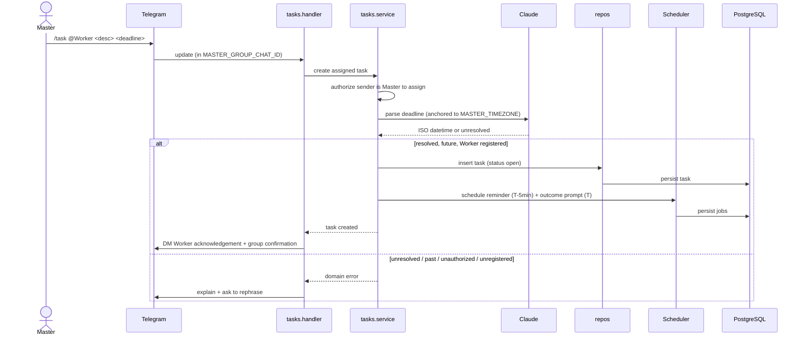
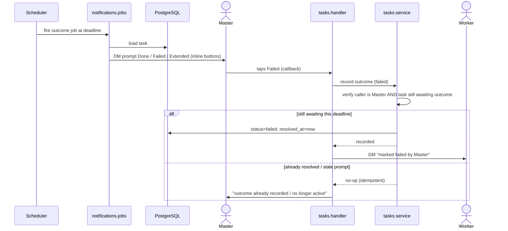

# Software Architecture Document — memento-task-core

<!-- 12 Arc42 sections. Empty section → <!-- N/A: <one-line reason> -->. -->
<!-- C4 Context (L1) lives inline in §3. C4 Container (L2) lives inline in §5. -->
<!-- Numbers in §10 come VERBATIM from spec.md §6 NFR — no inventing, no rounding. -->

## 1. Introduction and goals

**Intent.** Memento task-core closes the verbal-commitment accountability loop for a Telegram team. A single `/task` command in the configured Master group chat captures a commitment — Master-assigned (`/task @Worker <desc> <deadline>`) or Worker self-committed (`/task <desc> <deadline>`) — with a Claude-parsed deadline and a named Worker. A private reminder reaches the Worker 5 minutes before the deadline; at the deadline the Master receives a private Done / Failed / Extended prompt whose structured verdict is persisted. Extended tasks re-enter the full cycle with a new Master-supplied deadline. This is the **foundational** feature of the Memento bot — every downstream feature (statistics, reporting, escalation) depends on the audit trail it creates.

**Top-3 quality goals (1-liners; full scenarios in §10):**

1. **Notification timing reliability** — reminders and outcome prompts fire on time and survive bot restarts (zero scheduled jobs lost, ≤ 60 s drift). This *is* the product's value.
2. **Audit-trail integrity** — only the Master assigns to others and records outcomes; outcome transitions are idempotent, so the persisted verdict is always trustworthy.
3. **Task-creation responsiveness** — capturing a commitment (including deadline parsing) stays within p95 ≤ 5 s so the group conversation isn't held up.

**Stakeholders.**

| Role | Interest | Sign-off owner? |
|---|---|---|
| Master | Assigns tasks, records outcomes, monitors Worker commitments | No |
| Worker | Self-commits, receives reminders and verdicts, lists own open tasks | No |
| Product Owner | Owns the spec + the accountability-loop outcomes | No |
| Tech Lead | SAD approval | Yes |

<!-- Decision overrides (¶4) — populated by the critic resolution loop, empty otherwise. -->

## 2. Constraints

<!-- 🎯 Why: §4 strategy only works when §2 has fixed WHAT IS ALREADY FIXED — stack, versions,
     deadline, regulatory. This is an input, not an output.
     📋 Write: four blocks — Technical / Organisational / Conventions / Regulatory.
     📌 Pin versions («<datastore> 18», not «<datastore>»); «Q3 deadline — hard», not «ideally».
     Never N/A — every feature inherits at least Conventions + Technical. -->

**Technical.**
- Python 3.12; aiogram 3.x (async-native, built-in FSM) as the Telegram framework.
- PostgreSQL 16 via SQLAlchemy 2 (async) + asyncpg driver; Alembic migrations.
- APScheduler 3.x (`AsyncIOScheduler`) with a PostgreSQL job store for restart-safe timers.
- Anthropic Claude API (`claude-sonnet-4-6`) for natural-language deadline parsing; Pydantic Settings v2 for config.
- Feature-module layering — each feature lives in `bot/<feature>/` as `handler` · `service` · `repo` · `models` (per `CLAUDE.md`).

**Organisational.**
- Single-team, single-Master, single-bot-instance deployment (no horizontal scaling in v1).
- SDD + TDD workflow (red → green → refactor); per-task gate = pytest + ruff + mypy.
- First feature of a greenfield repo — sets precedent for every later feature.

**Conventions.**
- [`CLAUDE.md`](../../../CLAUDE.md) is authoritative: router-per-feature registered in `bot/main.py`; `AsyncSession` injected by `DbSessionMiddleware`; all SQL in `<feature>/repo.py`; services raise domain exceptions from `bot/shared/exceptions.py`.
- ID strategy: all primary keys are `UUID` (`uuid.uuid4()`) stored as PostgreSQL `UUID`.
- All Claude calls go through `bot/shared/claude_client.py`; all APScheduler jobs live in `bot/notifications/jobs.py`.

**Regulatory / external.**
- Data classification: Internal — task titles, deadlines, outcomes are operational team data. Personal data limited to Telegram user IDs, display names, and chat IDs (already present on the Telegram platform); no financial/health/government identifiers. No new authorization boundary beyond the `MASTER_TELEGRAM_ID` / `MASTER_GROUP_CHAT_ID` identity checks (spec §6.1).

## 3. Context and scope

<!-- 🎯 Why: draws the SYSTEM BOUNDARY — who talks to it from outside, where the trust zone ends.
     Without §3, §5 and §8 (authorization) blur — unclear what's «inside» vs «outside».
     📋 Write: 2–3 sentences of business context + an external-systems table + a C4Context block.
     📌 «External: none (deliberate, no third-party in v1)» is itself a decision worth stating.
     Trust boundary — the line past which you don't trust data without checking it.
     Never N/A — greenfield still draws the planned actors + external systems. -->

The Memento bot serves one team over Telegram. The Master and Workers interact with it exclusively through Telegram — there is no other UI. The bot depends on exactly two external systems: **Telegram** (delivers updates and button taps, receives outbound messages and inline keyboards) and the **Claude API** (parses natural-language deadlines into ISO datetimes). The **trust boundary** sits at the bot: it trusts only Telegram *user IDs* (never display names), only `MASTER_TELEGRAM_ID` for privileged actions (assigning to others, recording outcomes), and only messages originating in `MASTER_GROUP_CHAT_ID` for task capture. Everything crossing that boundary is validated before it is acted on.

<!-- brownfield: N/A — greenfield repo (architecture-map.md is the target baseline, reflects_commit n/a) -->

**External systems (in / out):**

| Actor or system | Type | Interaction |
|---|---|---|
| Master | Person | Sends `/task` in the group chat; taps Done/Failed/Extended and supplies new deadlines in private; lists a Worker's open tasks |
| Worker | Person | Self-commits via `/task`; receives private reminders + verdicts; lists own open tasks |
| Telegram | System (external) | Delivers updates & callback taps to the bot; delivers the bot's messages + inline keyboards to users |
| Claude API | System (external) | Parses a natural-language deadline string into an ISO datetime |

**C4 Context (L1):**



## 4. Solution strategy

<!-- 🎯 Why: the 3–4 STRATEGIC PILLARS every ADR grows from. Without §4 each ADR looks random —
     there's no umbrella. ⭐ The densest section — the blast-radius gate fires almost always here
     (decisions are irreversible + multi-module).
     📋 Write: 3–4 choices; each a heading + 2–3 sentences of rationale.
     📌 «Store content as a table of typed blocks» is a pillar — ADR-0001 grows from it. -->

**Target surface (D4.1):** `backend-service` — a single long-running aiogram process that consumes Telegram updates *and* hosts the in-process `AsyncIOScheduler`. Telegram is the UI (external); there is no web/mobile/CLI surface. This is a single, forced surface (the single-bot-instance constraint), so it is recorded in frontmatter `target_surfaces: [backend-service]` and drawn as one §5 container — no multi-surface ADR.

**Top strategic choices (the seeds for ADRs):**

1. **Single-process, event-driven bot over one store** — one aiogram process handles updates and runs the async scheduler; PostgreSQL 16 is the single store for domain data *and* scheduled timers. Serves the single-instance constraint and keeps operational surface minimal (§2). Durable scheduling → **ADR-0001**.
2. **Durable timers as the backbone (ADR-0001)** — every task owns two persisted APScheduler jobs (reminder at T-5min, outcome prompt at T) in a PostgreSQL job store, so pending timers survive a restart (QG-1, spec §6 "zero jobs lost across restarts", ≤ 60 s drift). Extend reschedules both jobs for the new deadline.
3. **Config-anchored trust (ADR-0003, ADR-0004)** — identity/authz and time both anchor to configuration: the Master is `MASTER_TELEGRAM_ID`, capture is confined to `MASTER_GROUP_CHAT_ID`, and one team `MASTER_TIMEZONE` governs both the relative-deadline parse anchor and all display. Timestamps persist as timezone-aware UTC. Keeps v1 single-Master / single-team and protects the audit trail's integrity (QG-2, spec §6.1).
4. **Synchronous, validated capture with an idempotent state machine (ADR-0002, ADR-0005)** — deadline parsing (Claude) + validation run inline during `/task`, trading a small latency budget (p95 ≤ 5 s, QG-3) for immediate group-chat feedback (AC-09). A single `status` field drives the task lifecycle (open → done/failed; Extend logs an extension, increments `extension_count`, and resets to open); outcome callbacks act only while the task still awaits an outcome, making stale/replayed taps idempotent (AC-13, QG-2).

Each tactical decision in later sections should trace to one of these seeds. Tactical decisions that *contradict* a strategic choice are red flags — surfaced in §11.

## 5. Building block view

<!-- 🎯 Why: INTERNAL DECOMPOSITION — modules, containers, datastores. The static topology: who
     may talk to whom. Without §5, §6 (the flows) has no vocabulary of participants.
     📋 Write: 1 ¶ on the style (layered / hexagonal / clean / event-driven) + a folder tree + a
     C4Container block.
     📌 Draw ONE Container per declared `target_surface` (frontmatter): a fullstack
     [backend-service, web-frontend] = a backend-API container + a web/SPA container; a
     [backend-service, mobile-app] = the API + the mobile app. The Container(web, …) line below is
     just one surface's container — swap/add per what was declared in §4. → _shared/surfaces.md
     📌 e.g. «web app, content API, media worker, datastore, object store, CDN». -->

The system is a **layered feature-module monolith** (per `CLAUDE.md`). Each feature is a folder
`bot/<feature>/` with four layers: `handler.py` (aiogram `Router` — receives updates, calls the
service), `service.py` (business logic — orchestrates repos, raises domain exceptions),
`repo.py` (all SQL — receives an `AsyncSession`, returns domain objects), `models.py` (ORM). It is
deliberately not hexagonal: the repo layer *is* the port to Postgres. Inter-module calls are direct
async function calls — `notifications` may import `tasks` and `users`; no other cross-module imports.

**Internal decomposition (modules touched by this feature):**

```
bot/
├── main.py            entry point — wires Dispatcher, includes feature routers, starts scheduler
├── config.py          Pydantic Settings — MASTER_TELEGRAM_ID, MASTER_GROUP_CHAT_ID, MASTER_TIMEZONE, …
├── tasks/             handler · service · repo · models — /task capture, outcome-button FSM, task lifecycle
├── users/             handler · service · repo · models — /start registration, Master/Worker lookup
├── notifications/     service · jobs — message builders + APScheduler reminder/outcome job functions
└── shared/            db (session middleware) · scheduler · claude_client · exceptions
```

**C4 Container (L2):**



## 6. Runtime view

<!-- 🎯 Why: the RUNTIME FLOW of 1–2 critical scenarios — who talks to whom, when, in what order.
     Without §6, §5 is just boxes with no life.
     📋 Write: a Mermaid sequenceDiagram. Participants are names from §5 (don't invent new ones).
     Messages are semantic («saves a draft»), NO HTTP verbs / paths / status codes — endpoint-level
     sequences arrive at the `api` stage.
     📌 e.g. «author → web: composes draft → web → content API: save». Seed the primary flow(s) here;
     the `sequences` stage then covers every §5 AC (no cap). Never N/A for M+; XS/S keeps ≥1 happy-path flow. -->

**Critical flow 1: Master assigns a task (capture)** — AC-01, AC-09, AC-10, AC-12.



**Critical flow 2: deadline outcome + idempotency** — AC-04, AC-05, AC-11, AC-13.



> **Extend** (AC-06, AC-14): on "Extended" the Master supplies a new deadline via an aiogram FSM
> reply; the service validates it is ≥ 5 min future, logs the extension (increments
> `extension_count`), resets status to `open`, and reschedules both jobs (ADR-0001, ADR-0005).
> The full per-AC sequence set is produced by the `sequences` stage.

## 7. Deployment view

<!-- 🎯 Why: the TOPOLOGY DevOps must know without reading the deploy charts — how many replicas,
     where the background worker lives, AT WHAT NUMBERS we scale.
     📋 Write: 2–3 sentences on topology + monitoring + concrete threshold numbers.
     📌 e.g. «500 authors → partition by quarter» (not «we'll think about scale later»).
     🎯 N/A allowed for XS/S that reuses an existing deployment unit with no change.
     Deployment-diagram scaffold → templates/deployment.md. -->

A single **bot process** container and one **PostgreSQL 16** container, orchestrated by Docker
Compose (`docker compose up`); migrations run via `docker compose run bot alembic upgrade head`.
Exactly one replica of the bot — the in-process `AsyncIOScheduler` and its PostgreSQL job store
assume a single instance (ADR-0001). The bot uses aiogram long-polling in v1 (no inbound webhook
endpoint to expose). Durable scheduled jobs survive container restarts because they live in Postgres,
not memory.

**Monitoring** (each maps to a spec §6 measurement):
- Per-request task-creation timing logged in the task handler → task-creation latency p95 ≤ 5 s.
- Job fire timestamp vs scheduled time logged on every reminder/outcome job → drift ≤ 60 s.
- DM send outcome logged; **alert** on DM delivery-failure rate → notification delivery ≥ 99%.
- Process monitor + a polling health check → availability ≥ 99.5% (monthly window).
- **Alert:** scheduler job fire drift > 60 s, or the bot process down.

**Scaling thresholds:**
- One team's volume (KPI target ≥ 5 tasks/work-day) is trivial for a single Postgres instance — no partitioning foreseen for years.
- Single instance is a hard ceiling for the in-process scheduler: horizontal scaling requires moving the job store to an external system (e.g. Redis) or a dedicated scheduler service (§11). Not needed in v1.

## 8. Crosscutting concepts

<!-- 🎯 Why: CROSS-CUTTING PATTERNS spanning several modules: logging, errors, authorization, ID
     strategy, events, caching. ⭐ The second-densest section. A pattern inside one module is NOT
     here; a project-wide convention belongs in the convention file.
     📋 Write: a table — concept / convention / where defined. One row per concept.
     📌 e.g. «sortable time-based IDs generated in the app layer» as a default from the convention file. -->

| Concept | Convention | Where defined |
|---|---|---|
| Authorization | On every group `/task` and every outcome callback, compare the caller's Telegram user ID against `MASTER_TELEGRAM_ID` / a registered-user row; act only on IDs, never display names | ADR-0003, spec §6.1 |
| Registration | A Worker row is persisted on first `/start`; "registered" = a users row exists (predicate for AC-12) | ADR-0003, `bot/users/` |
| Error handling | Services raise domain exceptions from `bot/shared/exceptions.py`; handlers catch them and send a user-facing reply; no bare `except` outside `main.py` | `CLAUDE.md`, `bot/shared/exceptions.py` |
| DB session access | Handlers/services receive an `AsyncSession` injected by `DbSessionMiddleware`; never instantiate sessions directly | `CLAUDE.md`, `bot/shared/db.py` |
| ID strategy | Primary keys are `UUID` (`uuid.uuid4()`), stored as PostgreSQL `UUID` | `CLAUDE.md` |
| Time & timezone | Store tz-aware UTC; parse relative deadlines against `MASTER_TIMEZONE` at receipt; format all user-facing times via one shared `MASTER_TIMEZONE` helper | ADR-0004, `bot/config.py` |
| Outcome idempotency | The outcome callback re-reads the task and no-ops unless it is still awaiting an outcome for the prompt's deadline (guards stale/replayed taps and post-Extend re-open) | ADR-0005, `bot/tasks/service.py` |
| Scheduling | Two jobs per task (reminder T-5min, outcome T) in the PostgreSQL job store; unschedule on resolve, reschedule both on Extend; all job functions live in `notifications/jobs.py`, given a `bot` instance at schedule time | ADR-0001, `CLAUDE.md`, `bot/notifications/jobs.py` |
| Claude API access | All Anthropic calls go through `bot/shared/claude_client.py`; feature modules never import `anthropic` | `CLAUDE.md`, `bot/shared/claude_client.py` |
| Notification delivery | DM send outcomes are logged; delivery failures are alerted; deliver only to registered Workers (have a private chat with the bot) | §7, spec §6 |
| Logging / observability | Structured logs: per-request task-creation timing (task handler) + job fire-vs-scheduled drift (notification jobs) | §7, spec §6 |
| Internationalisation | N/A — single team language; times localised to `MASTER_TIMEZONE` only | — |

## 9. Architecture decisions

<!-- 🎯 Why: the REVERSE INDEX onto the adr/ folder. `ls adr/` gives the files; §9 gives the
     semantics — why they exist, which SAD section they attach to, what status.
     📋 Write: a 4-column table, one row per ADR. Mixed status is fine.
     📌 e.g. «0001 | Store content as a table of typed blocks | Accepted | §4». -->

| # | Title | Status | Section |
|---|---|---|---|
| 0001 | Schedule durable per-task timers via APScheduler with a PostgreSQL job store | Accepted | §4, §5, §7 |
| 0002 | Parse deadlines synchronously in the task-creation flow | Accepted | §4, §6 |
| 0003 | Identify the Master by config and Workers by prior DM registration | Accepted | §4, §8 |
| 0004 | Store timestamps as UTC and anchor relative deadlines to MASTER_TIMEZONE | Accepted | §4, §8 |
| 0005 | Model the task lifecycle as a status field with state-checked idempotency | Accepted | §4, §6, §8 |

ADR files live under `docs/features/memento-task-core/adr/NNNN-<title>.md`.

## 10. Quality requirements

<!-- 🎯 Why: the QUALITY TREE — take a goal from §1 and break it into concrete leaves: tests,
     metrics, configs, drills. ⭐ Without §10, §1 is a manifesto. With §10 each declaration maps
     to something PROVABLE.
     📋 Write: per §1 goal — When / Then / How-verify. Numbers from spec §6 NFR VERBATIM (don't
     round ≤250ms to ≤300ms — that's a critic F6 hit).
     📌 e.g. «p95 ≤ 500 ms on a block update, verified by a 100 req/s load test». -->

Each top-3 goal from §1 expanded into a full scenario (numbers quoted verbatim from spec §6):

**QG-1. Notification timing reliability**
- **When:** the bot process restarts between a task's creation and its scheduled reminder/outcome jobs.
- **Then:** zero scheduled jobs are lost across the restart, and each reminder and outcome prompt fires within ≤ 60 s of its scheduled time.
- **How verify:** integration test — schedule a job → restart the process → confirm the job fires (SQLAlchemy job store); and compare job fire timestamp vs scheduled time in logs for drift ≤ 60 s.

**QG-2. Audit-trail integrity**
- **When:** the Master taps an outcome button, and a non-Master attempts a privileged action, and a stale/duplicate outcome tap arrives.
- **Then:** only the Master's action is recorded (≥ 99% notification delivery success for registered Workers on the resulting notifications); a duplicate/stale tap does not change the recorded outcome (idempotent, AC-13); non-Master privileged actions are denied.
- **How verify:** unit + integration tests for authz (AC-10, AC-11) and outcome idempotency (AC-13); log + alert on DM delivery failures to track the ≥ 99% delivery target.

**QG-3. Task-creation responsiveness**
- **When:** a Master or Worker sends `/task` with a natural-language deadline (including the Claude parse).
- **Then:** task creation completes end-to-end at p95 ≤ 5 s.
- **How verify:** per-request timing logged in the task handler; assert the p95 ≤ 5 s target from the timing logs.

_Availability (≥ 99.5% uptime, monthly window) is tracked via a process monitor + polling health check (spec §6, §7) as a supporting operational target below the top-3._

## 11. Risks and technical debt

<!-- 🎯 Why: ⭐ collects EVERYTHING that can break — not only the technical. Without §11 risks get
     discussed at standups and lost; debt lives only in the head of whoever accepted it.
     📋 Write: a risk/debt table — severity — mitigation — owner. Accepted debt in its own block.
     📌 The first risk is often a product risk, not a technical one. That's normal. -->

<!-- Severity literals: Low / Medium / High for regular risks; "Open question" for rows created by
     a Save-as-OQ resolution during the Socratic walk (see references/socratic.md). -->

| Risk / debt | Severity | Mitigation | Owner |
|---|---|---|---|
| Synchronous Claude parse on the creation path — a slow/unavailable Claude API blocks `/task` and eats the p95 ≤ 5 s budget (ADR-0002) | Medium | Timeout on the Claude call; monitor task-creation p95; move to async background parse if the budget is breached | Backend |
| Single bot instance is a hard scaling ceiling — the in-process scheduler + PostgreSQL job store assume one replica (ADR-0001) | Medium | Documented constraint; scale-out path = external job store (Redis) / dedicated scheduler, only if a second team/instance is needed | Backend |
| Long-polling instead of webhook — added end-to-end latency vs a webhook deployment | Low | Acceptable for v1 team scale; switch to webhook before production if latency matters (architecture-map) | DevOps |
| Status is mutated in place — no per-transition history beyond `extension_count`, `resolved_at`, and the extension timestamp | Low | Sufficient for the v1 audit trail + future stats; add an event log only if per-transition audit is later required | Backend |
| Open architectural decision: pending-limbo escalation — should the Master be re-prompted after 24 h of no action on an outcome prompt? | Open question | Resolve before `sdd:tasks`; default now = no auto-escalation in v1, the task stays pending (spec §8) | Product Owner |

**Accepted debt (acceptable in v1, plan to fix later):**
- Synchronous deadline parsing blocks the handler (ADR-0002) — acceptable within the ≤ 5 s budget; revisit if Claude latency grows.
- Single-instance scheduler (ADR-0001) — no HA/failover for timers in v1; a restart is safe (durable job store) but a prolonged process outage delays firings until recovery.

## 12. Glossary

<!-- 🎯 Why: ⭐ the DOMAIN GLOSSARY that ends arguments a year later («checkpoint — weekly or
     biweekly? quarter — calendar or fiscal?»).
     📋 Write: a term / meaning table. Business + technical terms mixed.
     📌 e.g. «Lesson | a unit inside a course made of blocks (text, video)». -->

| Term | Meaning |
|---|---|
| Master | The single privileged user (identified by `MASTER_TELEGRAM_ID`) who assigns tasks to others and records Done/Failed/Extended verdicts. Not a DB role — a config identity. |
| Worker | A team member who self-commits or is assigned tasks and receives reminders/verdicts. A *registered* Worker has previously DM'd the bot (has a users row). |
| Task | A captured commitment: assignee (Worker), overseer (Master), title, deadline, status, `resolved_at`, and `extension_count`. |
| deadline | A point in time extracted from natural-language input and stored as a tz-aware UTC timestamp. NOT the reminder (which fires before it). |
| open / done / failed | Task lifecycle statuses. `open` = awaiting outcome; `done`/`failed` = Master verdict recorded; Extend re-opens with a new deadline. |
| Extend | A Master outcome that sets a new future deadline (≥ 5 min out), increments `extension_count`, resets status to `open`, and reschedules both jobs. |
| outcome prompt | The private Done/Failed/Extended message sent to the Master at the deadline. Only the Master receives an actionable prompt. |
| outcome idempotency | The invariant (AC-13) that a stale or duplicate outcome tap does not change the recorded outcome — enforced by a task-state check. |
| MASTER_GROUP_CHAT_ID / MASTER_TIMEZONE | The one group chat where `/task` is honoured; the one IANA timezone used to parse relative deadlines and format all user-facing times. |
