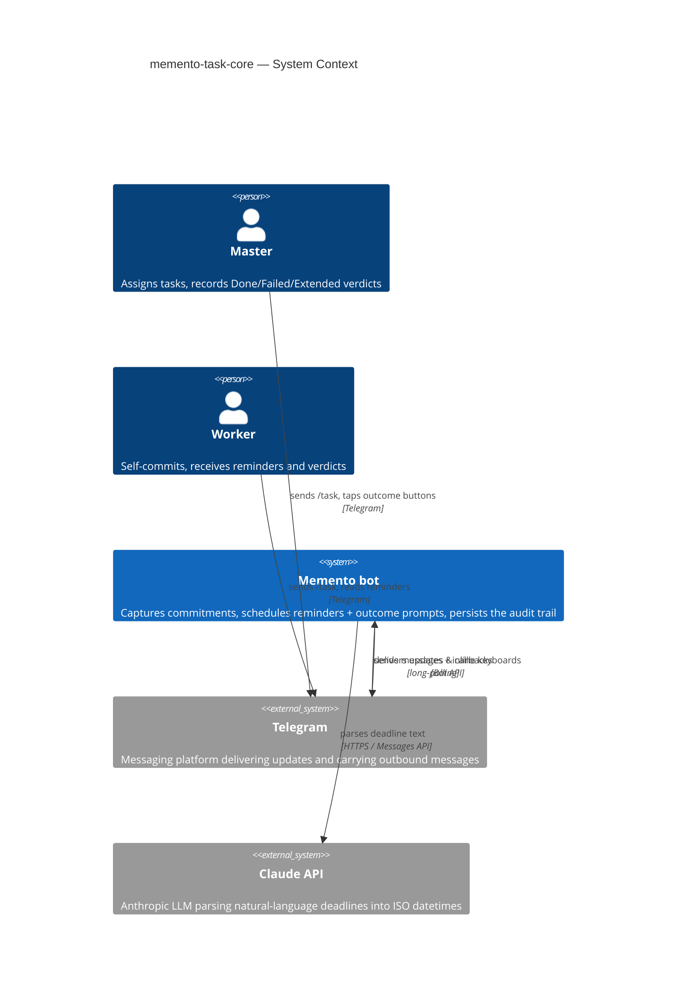
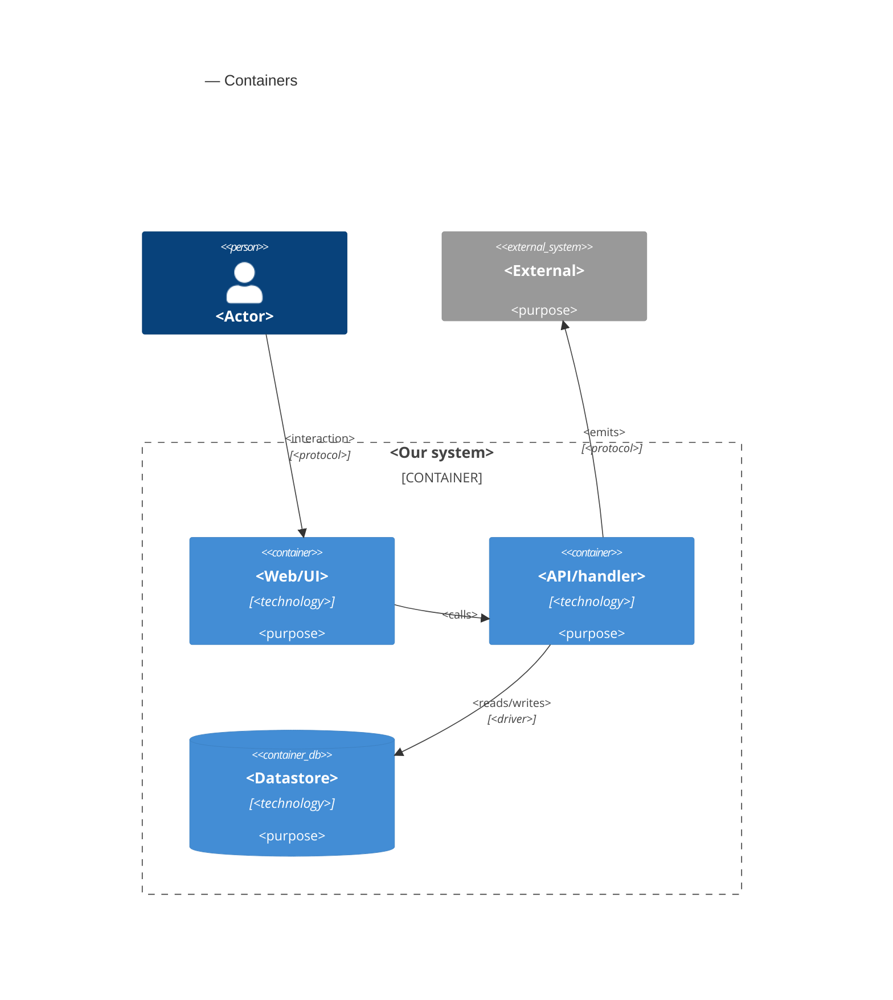

# Software Architecture Document — memento-task-core

<!-- 12 Arc42 sections. Empty section → <!-- N/A: <one-line reason> -->. -->
<!-- C4 Context (L1) lives inline in §3. C4 Container (L2) lives inline in §5. -->
<!-- Numbers in §10 come VERBATIM from spec.md §6 NFR — no inventing, no rounding. -->

## 1. Introduction and goals

**Intent.** Memento task-core closes the verbal-commitment accountability loop for a Telegram team. A single `/task` command in the configured Master group chat captures a commitment — Master-assigned (`/task @Worker <desc> <deadline>`) or Worker self-committed (`/task <desc> <deadline>`) — with a Claude-parsed deadline and a named Worker. A private reminder reaches the Worker 5 minutes before the deadline; at the deadline the Master receives a private Done / Failed / Extended prompt whose structured verdict is persisted. Extended tasks re-enter the full cycle with a new Master-supplied deadline. This is the **foundational** feature of the Memento bot — every downstream feature (statistics, reporting, escalation) depends on the audit trail it creates.

**Top-3 quality goals (1-liners; full scenarios in §10):**

1. **Notification timing reliability** — reminders and outcome prompts fire on time and survive bot restarts (zero scheduled jobs lost, ≤ 60 s drift). This *is* the product's value.
2. **Audit-trail integrity** — only the Master assigns to others and records outcomes; outcome transitions are idempotent, so the persisted verdict is always trustworthy.
3. **Task-creation responsiveness** — capturing a commitment (including deadline parsing) stays within p95 ≤ 5 s so the group conversation isn't held up.

**Stakeholders.**

| Role | Interest | Sign-off owner? |
|---|---|---|
| Master | Assigns tasks, records outcomes, monitors Worker commitments | No |
| Worker | Self-commits, receives reminders and verdicts, lists own open tasks | No |
| Product Owner | Owns the spec + the accountability-loop outcomes | No |
| Tech Lead | SAD approval | Yes |

<!-- Decision overrides (¶4) — populated by the critic resolution loop, empty otherwise. -->

## 2. Constraints

<!-- 🎯 Why: §4 strategy only works when §2 has fixed WHAT IS ALREADY FIXED — stack, versions,
     deadline, regulatory. This is an input, not an output.
     📋 Write: four blocks — Technical / Organisational / Conventions / Regulatory.
     📌 Pin versions («<datastore> 18», not «<datastore>»); «Q3 deadline — hard», not «ideally».
     Never N/A — every feature inherits at least Conventions + Technical. -->

**Technical.**
- Python 3.12; aiogram 3.x (async-native, built-in FSM) as the Telegram framework.
- PostgreSQL 16 via SQLAlchemy 2 (async) + asyncpg driver; Alembic migrations.
- APScheduler 3.x (`AsyncIOScheduler`) with a PostgreSQL job store for restart-safe timers.
- Anthropic Claude API (`claude-sonnet-4-6`) for natural-language deadline parsing; Pydantic Settings v2 for config.
- Feature-module layering — each feature lives in `bot/<feature>/` as `handler` · `service` · `repo` · `models` (per `CLAUDE.md`).

**Organisational.**
- Single-team, single-Master, single-bot-instance deployment (no horizontal scaling in v1).
- SDD + TDD workflow (red → green → refactor); per-task gate = pytest + ruff + mypy.
- First feature of a greenfield repo — sets precedent for every later feature.

**Conventions.**
- [`CLAUDE.md`](../../../CLAUDE.md) is authoritative: router-per-feature registered in `bot/main.py`; `AsyncSession` injected by `DbSessionMiddleware`; all SQL in `<feature>/repo.py`; services raise domain exceptions from `bot/shared/exceptions.py`.
- ID strategy: all primary keys are `UUID` (`uuid.uuid4()`) stored as PostgreSQL `UUID`.
- All Claude calls go through `bot/shared/claude_client.py`; all APScheduler jobs live in `bot/notifications/jobs.py`.

**Regulatory / external.**
- Data classification: Internal — task titles, deadlines, outcomes are operational team data. Personal data limited to Telegram user IDs, display names, and chat IDs (already present on the Telegram platform); no financial/health/government identifiers. No new authorization boundary beyond the `MASTER_TELEGRAM_ID` / `MASTER_GROUP_CHAT_ID` identity checks (spec §6.1).

## 3. Context and scope

<!-- 🎯 Why: draws the SYSTEM BOUNDARY — who talks to it from outside, where the trust zone ends.
     Without §3, §5 and §8 (authorization) blur — unclear what's «inside» vs «outside».
     📋 Write: 2–3 sentences of business context + an external-systems table + a C4Context block.
     📌 «External: none (deliberate, no third-party in v1)» is itself a decision worth stating.
     Trust boundary — the line past which you don't trust data without checking it.
     Never N/A — greenfield still draws the planned actors + external systems. -->

The Memento bot serves one team over Telegram. The Master and Workers interact with it exclusively through Telegram — there is no other UI. The bot depends on exactly two external systems: **Telegram** (delivers updates and button taps, receives outbound messages and inline keyboards) and the **Claude API** (parses natural-language deadlines into ISO datetimes). The **trust boundary** sits at the bot: it trusts only Telegram *user IDs* (never display names), only `MASTER_TELEGRAM_ID` for privileged actions (assigning to others, recording outcomes), and only messages originating in `MASTER_GROUP_CHAT_ID` for task capture. Everything crossing that boundary is validated before it is acted on.

<!-- brownfield: N/A — greenfield repo (architecture-map.md is the target baseline, reflects_commit n/a) -->

**External systems (in / out):**

| Actor or system | Type | Interaction |
|---|---|---|
| Master | Person | Sends `/task` in the group chat; taps Done/Failed/Extended and supplies new deadlines in private; lists a Worker's open tasks |
| Worker | Person | Self-commits via `/task`; receives private reminders + verdicts; lists own open tasks |
| Telegram | System (external) | Delivers updates & callback taps to the bot; delivers the bot's messages + inline keyboards to users |
| Claude API | System (external) | Parses a natural-language deadline string into an ISO datetime |

**C4 Context (L1):**



## 4. Solution strategy

<!-- 🎯 Why: the 3–4 STRATEGIC PILLARS every ADR grows from. Without §4 each ADR looks random —
     there's no umbrella. ⭐ The densest section — the blast-radius gate fires almost always here
     (decisions are irreversible + multi-module).
     📋 Write: 3–4 choices; each a heading + 2–3 sentences of rationale.
     📌 «Store content as a table of typed blocks» is a pillar — ADR-0001 grows from it. -->

**Top strategic choices (the seeds for ADRs):**

1. **<e.g. Module isolation through events>** — <2–3 sentences citing quality goals + constraints>.
2. **<e.g. Single-store persistence>** — <2–3 sentences>.
3. **<e.g. Server-rendered read side>** — <2–3 sentences>.

Each tactical decision in later sections should trace to one of these seeds. Tactical decisions that *contradict* a strategic choice are red flags — surface them in §11.

## 5. Building block view

<!-- 🎯 Why: INTERNAL DECOMPOSITION — modules, containers, datastores. The static topology: who
     may talk to whom. Without §5, §6 (the flows) has no vocabulary of participants.
     📋 Write: 1 ¶ on the style (layered / hexagonal / clean / event-driven) + a folder tree + a
     C4Container block.
     📌 Draw ONE Container per declared `target_surface` (frontmatter): a fullstack
     [backend-service, web-frontend] = a backend-API container + a web/SPA container; a
     [backend-service, mobile-app] = the API + the mobile app. The Container(web, …) line below is
     just one surface's container — swap/add per what was declared in §4. → _shared/surfaces.md
     📌 e.g. «web app, content API, media worker, datastore, object store, CDN». -->

<One paragraph: layered / hexagonal / clean / event-driven, and why.>

**Internal decomposition:**

```
<e.g. modules/<feature>/>
├── domain/       <entities + sentinel errors>
├── app/          <use cases / services>
├── infra/        <repository + integration impl>
├── ports/        <handlers, DTOs, error mapping>
└── wiring        <self-wiring entry point>
```

**C4 Container (L2):** <!-- syntax → references/c4-mermaid-syntax.md. Real names, no <placeholder> stubs. ONE Container per declared target_surface (frontmatter); the web container below is one example surface. -->



## 6. Runtime view

<!-- 🎯 Why: the RUNTIME FLOW of 1–2 critical scenarios — who talks to whom, when, in what order.
     Without §6, §5 is just boxes with no life.
     📋 Write: a Mermaid sequenceDiagram. Participants are names from §5 (don't invent new ones).
     Messages are semantic («saves a draft»), NO HTTP verbs / paths / status codes — endpoint-level
     sequences arrive at the `api` stage.
     📌 e.g. «author → web: composes draft → web → content API: save». Seed the primary flow(s) here;
     the `sequences` stage then covers every §5 AC (no cap). Never N/A for M+; XS/S keeps ≥1 happy-path flow. -->

**Critical flow 1: <flow name>**

```mermaid
sequenceDiagram
    actor Actor
    participant Web
    participant Service
    participant Store
    Actor->>Web: <action>
    Web->>Service: <call>
    Service->>Store: <write>
    Store-->>Service: ok
    Service-->>Web: result
    Web-->>Actor: confirmation
```

**Critical flow 2: <e.g. async event propagation>** — <if applicable, otherwise N/A>.

## 7. Deployment view

<!-- 🎯 Why: the TOPOLOGY DevOps must know without reading the deploy charts — how many replicas,
     where the background worker lives, AT WHAT NUMBERS we scale.
     📋 Write: 2–3 sentences on topology + monitoring + concrete threshold numbers.
     📌 e.g. «500 authors → partition by quarter» (not «we'll think about scale later»).
     🎯 N/A allowed for XS/S that reuses an existing deployment unit with no change.
     Deployment-diagram scaffold → templates/deployment.md. -->

<Topology in 2–3 sentences. Where it runs, replicas, scaling thresholds.>

**Monitoring:**
- <Metrics — e.g. `<metric_name>`>
- <Alerts — e.g. «worker lag > 10 min → page on-call»>
- <Tracing — e.g. spans on the request boundary>

**Scaling thresholds:**
- <e.g. comfortable in one table up to N rows/year>
- <e.g. partition by quarter above N rows/year>

<!-- For XS/S with no deployment change: <!-- N/A: reuses existing deployment unit, no infra change --> -->

## 8. Crosscutting concepts

<!-- 🎯 Why: CROSS-CUTTING PATTERNS spanning several modules: logging, errors, authorization, ID
     strategy, events, caching. ⭐ The second-densest section. A pattern inside one module is NOT
     here; a project-wide convention belongs in the convention file.
     📋 Write: a table — concept / convention / where defined. One row per concept.
     📌 e.g. «sortable time-based IDs generated in the app layer» as a default from the convention file. -->

| Concept | Convention | Where defined |
|---|---|---|
| Logging | <e.g. structured, fields `module=<name>`> | <convention file §X or here> |
| Authentication | <e.g. token-based via middleware> | <convention file §X> |
| Error handling | <e.g. domain sentinel → ports error mapping → JSON> | <convention file §X> |
| ID strategy | <e.g. sortable time-based ID in the app layer> | <convention file §X> |
| Internationalisation | <e.g. N/A, single language> | — |
| Observability | <e.g. tracing on the request boundary> | — |
| Events | <module-specific patterns, if any> | <here> |

## 9. Architecture decisions

<!-- 🎯 Why: the REVERSE INDEX onto the adr/ folder. `ls adr/` gives the files; §9 gives the
     semantics — why they exist, which SAD section they attach to, what status.
     📋 Write: a 4-column table, one row per ADR. Mixed status is fine.
     📌 e.g. «0001 | Store content as a table of typed blocks | Accepted | §4». -->

| # | Title | Status | Section |
|---|---|---|---|
| <NNNN> | <imperative — e.g. "Use a sliding-window counter for rate limiting"> | Accepted | §<N> |
| <NNNN> | <imperative — e.g. "Co-locate the worker in the API process"> | Accepted | §<N> |

ADR files live under `docs/features/<slug>/adr/NNNN-<title>.md`.

## 10. Quality requirements

<!-- 🎯 Why: the QUALITY TREE — take a goal from §1 and break it into concrete leaves: tests,
     metrics, configs, drills. ⭐ Without §10, §1 is a manifesto. With §10 each declaration maps
     to something PROVABLE.
     📋 Write: per §1 goal — When / Then / How-verify. Numbers from spec §6 NFR VERBATIM (don't
     round ≤250ms to ≤300ms — that's a critic F6 hit).
     📌 e.g. «p95 ≤ 500 ms on a block update, verified by a 100 req/s load test». -->

Each top-3 goal from §1 expanded into a full scenario:

**QG-1. <quality attribute>**
- **When:** <trigger condition>
- **Then:** <expected behaviour with numbers from spec §6 NFR>
- **How verify:** <test / chaos drill / load test / metric>

**QG-2. <quality attribute>**
- **When:** <trigger>
- **Then:** <expected>
- **How verify:** <how>

**QG-3. <quality attribute>**
- **When:** <trigger>
- **Then:** <expected>
- **How verify:** <how>

## 11. Risks and technical debt

<!-- 🎯 Why: ⭐ collects EVERYTHING that can break — not only the technical. Without §11 risks get
     discussed at standups and lost; debt lives only in the head of whoever accepted it.
     📋 Write: a risk/debt table — severity — mitigation — owner. Accepted debt in its own block.
     📌 The first risk is often a product risk, not a technical one. That's normal. -->

<!-- Severity literals: Low / Medium / High for regular risks; "Open question" for rows created by
     a Save-as-OQ resolution during the Socratic walk (see references/socratic.md). -->

| Risk / debt | Severity | Mitigation | Owner |
|---|---|---|---|
| <e.g. Worker lag may reach hours during a downstream outage> | Medium | <alert >10 min, on-call playbook, retry backoff> | <DevOps> |
| <e.g. No event-schema versioning in v1> | Medium | <ADR-NNNN planned for v2, tolerate unknown fields> | <Backend> |
| Open architectural decision: <decision-headline> | Open question | Resolve before <stage trigger or YYYY-MM-DD>; <inline rationale from the Save-as-OQ> | <owner> |

**Accepted debt (acceptable in v1, plan to fix later):**
- <e.g. the entity is immutable / unversioned — OK for v1, may need audit versioning in v2>

## 12. Glossary

<!-- 🎯 Why: ⭐ the DOMAIN GLOSSARY that ends arguments a year later («checkpoint — weekly or
     biweekly? quarter — calendar or fiscal?»).
     📋 Write: a term / meaning table. Business + technical terms mixed.
     📌 e.g. «Lesson | a unit inside a course made of blocks (text, video)». -->

| Term | Meaning |
|---|---|
| <e.g. domain object A> | <its meaning in this domain> |
| <e.g. domain object B> | <its meaning> |
| <e.g. domain invariant name> | <the rule, in plain language> |
